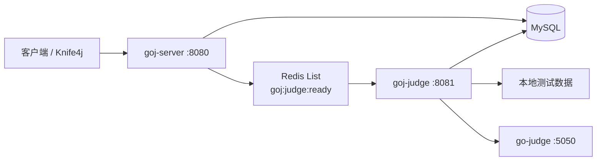

# GOJ

基于 Spring Boot 的在线判题系统后端。项目采用 Maven 多模块结构，将业务 API 与判题 Worker 分离，并通过 Redis List 异步传递提交 ID，由独立的 `goj-judge` Worker 调用 [go-judge](https://github.com/criyle/go-judge) 沙箱完成编译和运行。

> 当前项目处于开发阶段，适合用于学习在线判题系统的认证、题目查询、异步任务和沙箱测评链路，暂不建议直接用于生产环境。

当前文档对应 `master` 分支最新提交 [`639ae8f`](https://github.com/baixuezhuawa/GOJ/commit/639ae8fffb812c3703a60a5e4b697c2d04c9540f)，其中合入的判题功能提交为 [`d247b11`](https://github.com/baixuezhuawa/GOJ/commit/d247b11a8973f2195d1b3803f3dc36896d111f09)。该版本已完成 Java 11、Python 3 判题，并验证 AC、WA、TLE、MLE、RE 场景。

## 已实现功能

- 用户注册、登录、退出和当前用户查询
- Spring Security + JWT + Redis 登录态认证
- BCrypt 密码加密及角色、权限数据模型
- 题目分页查询、关键字/难度筛选和题目详情
- Java 11、Python 3 代码提交及语言白名单校验
- 基于 Redis List 的异步 FIFO 判题队列
- Worker 原子领取任务，避免同一提交被重复执行
- 通过 go-judge 完成编译、运行和资源限制
- 多测试点顺序测评及标准输出比对
- 记录最大运行时间、最大内存和编译/运行信息
- Java 编译产物缓存及测评结束后的沙箱缓存清理
- Knife4j / OpenAPI 接口文档

## 系统架构



一次提交的主要流程：

1. `goj-server` 校验源码和语言，将提交记录写入 MySQL，状态设为 `in queue`。
2. Server 将 `submissionId` 写入 Redis 队列 `goj:judge:ready`。
3. `goj-judge` 从队列右侧阻塞读取任务，并通过数据库条件更新原子领取任务。
4. Worker 从 MySQL 重新加载提交、题目和测试数据元信息。
5. 语言适配器构造 go-judge 请求；Java 11 先编译后运行，Python 3 直接运行。
6. Worker 逐个执行测试点，汇总耗时与内存，并将最终状态写回 MySQL。
7. Java 测评结束后删除 go-judge 中缓存的编译产物。

状态流转如下：

```text
in queue -> wait -> compiling（仅编译型语言）-> running
                                                    |
                                                    +-> Accepted
                                                    +-> Wrong Answer
                                                    +-> Compile Error
                                                    +-> Time Limit Exceeded
                                                    +-> Memory Limit Exceeded
                                                    +-> Runtime Error
                                                    +-> system error
```

## 技术栈

| 分类 | 技术 |
| --- | --- |
| 项目运行环境 | Java 21、Maven |
| 基础框架 | Spring Boot 3.5.16、Spring Cloud 2025.0.0 |
| Web 与认证 | Spring MVC、Spring Security、JWT |
| 数据访问 | MyBatis-Plus 3.5.16、MySQL |
| 异步队列与登录态 | Redis |
| 服务调用 | Spring Cloud OpenFeign |
| 接口文档 | springdoc-openapi、Knife4j |
| 判题沙箱 | go-judge |
| 提交语言 | Java 11、Python 3 |

> Java 21 是 GOJ 服务自身的运行环境；Java 11 是当前沙箱内用于编译用户提交的工具链，两者不是同一个概念。

## 项目结构

```text
GOJ
├─ common       公共返回模型、常量及 Problem、Submission 等共享实体
├─ goj-server   用户、题目、提交 API，以及认证和任务入队
├─ goj-judge    Redis 队列消费、语言适配、判题编排和沙箱调用
├─ sql
│  ├─ schema.sql  数据库表结构
│  └─ data.sql    开发环境角色、权限、题目和测试数据元信息
└─ pom.xml      Maven 聚合父工程
```

## 运行环境

启动项目前请准备：

- JDK 21
- Maven 3.9+
- MySQL 8.x
- Redis 6.x 或更高版本
- 可访问的 go-judge 实例
- 沙箱内可用的 JDK 11 与 Python 3 工具链
- 与数据库元信息匹配的本地测试数据文件

项目默认端口：

| 服务 | 默认端口 |
| --- | ---: |
| `goj-server` | 8080 |
| `goj-judge` | 8081 |
| go-judge | 5050 |
| MySQL | 3306 |
| Redis | 6379 |

## 快速开始

### 1. 获取代码

```bash
git clone https://github.com/baixuezhuawa/GOJ.git
cd GOJ
```

### 2. 初始化数据库

`schema.sql` 包含 `DROP TABLE IF EXISTS`，仅应直接用于全新开发数据库；已有数据请先备份。

```bash
mysql -u root -p < sql/schema.sql
mysql -u root -p goj < sql/data.sql
```

也可以在 MySQL 客户端中依次执行 [`sql/schema.sql`](sql/schema.sql) 和 [`sql/data.sql`](sql/data.sql)。初始化数据包含开发管理员：

```text
用户名：admin
密码：Admin@123456
```

首次登录后请立即修改默认密码。

### 3. 修改本地配置

根据实际环境修改以下文件：

- [`goj-server/src/main/resources/application.yml`](goj-server/src/main/resources/application.yml)：MySQL、Redis、可提交语言和源码长度限制
- [`goj-judge/src/main/resources/application.yml`](goj-judge/src/main/resources/application.yml)：MySQL、Redis、测试数据根目录、go-judge 地址和沙箱工具链路径

JWT 密钥通过环境变量 `GOJ_JWT_SECRET` 提供，不要将真实密钥提交到仓库。

PowerShell：

```powershell
$env:GOJ_JWT_SECRET = "请替换为足够长的随机字符串"
```

Bash：

```bash
export GOJ_JWT_SECRET="请替换为足够长的随机字符串"
```

`goj.judge.languages.*` 中的可执行文件路径是 go-judge 沙箱镜像内的路径，需要与实际镜像保持一致。

### 4. 准备测试数据

当前提交只包含测试数据元信息，不包含真实测试文件。`goj-judge` 按以下结构读取文件：

```text
<goj.judge.data-root>
└─ p1
   ├─ test1
   │  ├─ input.txt
   │  └─ output.txt
   ├─ test2
   │  ├─ input.txt
   │  └─ output.txt
   └─ test3
      ├─ input.txt
      └─ output.txt
```

其中 `p1` 对应题目 ID 1，`test1` 对应第 1 个测试点。必须完整提供从 `test1` 到 `test{test_node_count}` 的输入和输出文件，否则该提交会结束为 `system error`。

### 5. 启动 go-judge

按照 [go-judge 官方文档](https://github.com/criyle/go-judge) 启动沙箱，并将 Worker 配置中的 `goj.judge.sandbox-base-url` 指向该实例。运行用户代码的沙箱应与 GOJ API 服务隔离部署。

### 6. 构建项目

```bash
mvn clean package -DskipTests
```

当前测试会连接 MySQL、Redis 和 go-judge，因此首次构建可跳过测试；外部依赖配置完成后再执行：

```bash
mvn test
```

### 7. 启动 Server 与 Worker

在两个终端中分别运行：

```bash
java -jar goj-server/target/goj-server-0.0.1-SNAPSHOT.jar
```

```bash
java -jar goj-judge/target/goj-judge-0.0.1-SNAPSHOT.jar
```

启动后可访问：

- Knife4j：<http://localhost:8080/doc.html>
- OpenAPI JSON：<http://localhost:8080/v3/api-docs>
- 题目列表：<http://localhost:8080/problem/list>

## 主要接口

| 方法 | 路径 | 认证 | 说明 |
| --- | --- | --- | --- |
| POST | `/user/register` | 否 | 用户注册，默认授予 `USER` 角色 |
| POST | `/user/login` | 否 | 登录并返回 JWT |
| POST | `/user/logout` | 是 | 删除 Redis 登录态并退出 |
| GET | `/user/me` | 是 | 查询当前用户及权限 |
| GET | `/problem/list` | 否 | 查询题目列表 |
| GET | `/problem/{problemId}` | 否 | 查询题目详情 |
| POST | `/submission/submit` | 是 | 创建提交并加入判题队列 |
| GET | `/submission/submission/{submissionId}` | 是 | 查询提交状态 |

除公开接口外，请携带登录接口返回的 Token：

```http
Authorization: Bearer <token>
```

Python 3 的 A+B 提交示例：

```json
{
  "problemId": 1,
  "language": "py3",
  "sourceCode": "a, b = map(int, input().split())\nprint(a + b)"
}
```

提交接口返回成功只表示任务已经写入数据库并进入队列，不代表最终 AC。获得提交 ID 后，应继续查询提交记录，直到状态进入终态；当前提交接口还没有返回该 ID，这是此版本的已知限制。

## 当前边界

- 仓库目前只包含后端，没有 Web 前端。
- 提交接口在当前版本中尚未返回 `submissionId`，状态查询需要已知提交 ID，且查询接口尚未校验提交归属。
- Redis List 消费后没有确认、自动重试、死信队列和宕机恢复机制。
- 题目列表中的标签筛选和“仅看未通过”字段尚未接入查询逻辑。
- 测试数据文件未随仓库分发，需要开发者自行准备。
- Worker 当前使用 Windows 风格路径拼接测试数据，尚未直接使用数据库中的 `storage_path`。
- 数据库账号、Redis、沙箱地址和工具链路径仍是本地开发配置，部署前必须外部化。
- 当前测试以环境集成和冒烟验证为主，尚未建立完整的自动化测试与 CI。

## 后续计划

- 完成题目草稿、测试数据上传和管理员审核流程
- 让提交接口返回 `submissionId`，并补充提交记录归属校验
- 增加队列确认、重试、死信和卡住任务恢复机制
- 完善语言适配器测试与完整判题状态矩阵
- 增加比赛、排行榜、提交历史和前端页面
- 提供 Docker Compose 与生产环境配置示例

## 说明

本项目用于学习和实践在线判题系统设计。运行不受信任代码时，请始终使用独立沙箱，并限制网络、文件系统、进程数、CPU 和内存资源。

仓库当前未添加开源许可证；在许可证明确前，默认保留所有权利。
